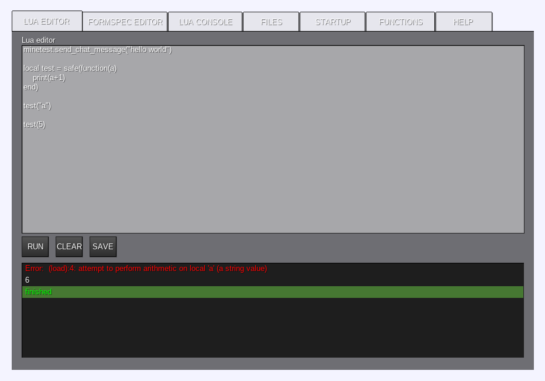

# CSM DTE
## Client Side Mod Designing & Testing Environment
An advanced, ingame lua and formspec editor for minetest.

This can be used for creating, testing and using CSMs without reloading the game, and without the game crashing.
This is also the easiest way to create advanced formspecs.
It was tested with multiple CSMs from the minetest forums, and they all worked. (actually in the current version, a few things might not work, but they will be fixed in the future)

CSMs can be created, or pasted in, and they should work the same as they would normaly, except errors won't crash the game!

functions that are registered with minetest can be put in a function `safe(func)` to output errors to the UI when minetest calls them

scripts can be put in startup to run them automatically when the game loads. errors are also put in the UI

screenshots:

## FEATURES:
lua editor:
- print function
- coloured error output
- multiple files
- file creation and deletion
- safe function execution
- automatically run files at startup

formspec editor:
- every widget is available
- widgets are easy to edit
- formspec preview, shows what it will look like
- export as a function with parameters
- export as a string
- and a whole bunch of fancy stuff

## To Use:
- use the command `.dte` to open the editor
- select the `lua editor` tab to run and edit CSMs
- select the `formspec editor` tab to create a formspec
- select the `files` tab to open, create, and delete files
- select the `startup` tab to select lua files to run when the game loads

## How to install
- make sure you have client modding enabled (search for `client modding` in advanced settings, and set it to true)
- download and extract the zip file into `clientmods\csm_dte` or paste the `init.lua` file into it.
- add `load_mod_csm_dte = true` to the `clientmods\mods.conf` file
- join a game or server, and it should work!

## Editing the files
### - if you do not wan't to edit the program, the `development` folder can be deleted!
when editing the program, it is easier to edit the smaller files found inside the `development` folder.
these can be run as seperate CSMs for testing (I recomend disabling `csm_dte`)
to join the together, copy the lua editor into `csm_dte/init.lua` and copy the formspec editor (from EDITOR START to EDITOR END) into the "PASTE FORMSPEC EDITOR HERE" section

### TODO:
- make all functions work after the game has been loaded
- add a UI to unregister functions which were registered from a program
- add a lua console
- import ui strings into the editor (?)
